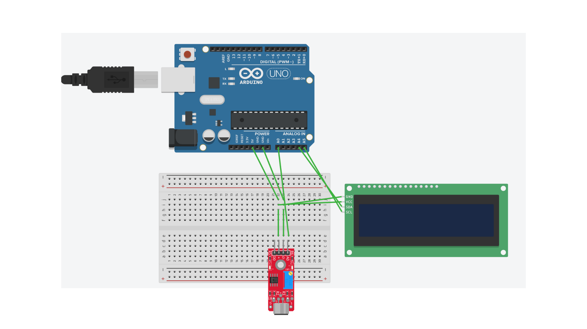

# Music Game/Frequency Reader
My project is a device that can read the frequency of a musical note, specifically from a trombone, and output what note it is, along with its frequency. It can also determine how many hertz a note played is from an intended note, average out these notes, and give you a score/ranking based on the averaging of how accurate each of the notes was. I decided to do this project because I thought it was a perfect balance of too easy and too hard, it seemed fun and interesting to do, as well as figure out how to code it on my own, it would help me with my trombone practicing by adding a gamified aspect to it, and it combined 3 of my interests/hobbies: video games, computer science, and playing trombone.


| **Engineer** | **School** | **Area of Interest** | **Grade** |
|:--:|:--:|:--:|:--:|
| Gregory R | Hong Kong International School | Computer Science | Incoming Freshman


  
# Final Milestone

**Don't forget to replace the text below with the embedding for your milestone video. Go to Youtube, click Share -> Embed, and copy and paste the code to replace what's below.**

<iframe width="560" height="315" src="https://www.youtube.com/embed/F7M7imOVGug" title="YouTube video player" frameborder="0" allow="accelerometer; autoplay; clipboard-write; encrypted-media; gyroscope; picture-in-picture; web-share" allowfullscreen></iframe>

For your final milestone, explain the outcome of your project. Key details to include are:
- What you've accomplished since your previous milestone
- What your biggest challenges and triumphs were at BSE
- A summary of key topics you learned about
- What you hope to learn in the future after everything you've learned at BSE


# Second Milestone

**Don't forget to replace the text below with the embedding for your milestone video. Go to Youtube, click Share -> Embed, and copy and paste the code to replace what's below.**

<iframe width="560" height="315" src="https://www.youtube.com/embed/DfssOINo9t8?si=iSMWN71nb382KMqz" title="YouTube video player" frameborder="0" allow="accelerometer; autoplay; clipboard-write; encrypted-media; gyroscope; picture-in-picture; web-share" referrerpolicy="strict-origin-when-cross-origin" allowfullscreen></iframe>


Since the filming of my previous milestone video, I have managed to successfully implement the frequency-note conversion system, which takes the frequency value that was acquired and determines what note that frequency is closest to, by use of a large number of "if" statements. Ironically, it was surprisingly easy to make the frequency-to-note converter, but I struggled much more with the frequency detector in my 1st milestone. There were a few challenges that I needed to overcome to get to this stage. I feel that the biggest one I had was that I couldn't get a fast enough sample rate based on the function "analogRead" alone, as the Arduino UNO was too slow for those purposes (I chose the UNO because the base project that I was using used the components of a UNO and a sound sensor). This meant I had to find some sort of sampling program that could take in inputs at a high rate. To complete my final milestone, I must integrate the screen to display notes and incorporate the scoring system and note accuracy system.

# First Milestone

**Don't forget to replace the text below with the embedding for your milestone video. Go to Youtube, click Share -> Embed, and copy and paste the code to replace what's below.**

<iframe width="560" height="315" src="https://www.youtube.com/embed/A0bFmoxoMo8?si=LV5PQAj5vhVgiuPV" title="YouTube video player" frameborder="0" allow="accelerometer; autoplay; clipboard-write; encrypted-media; gyroscope; picture-in-picture; web-share" referrerpolicy="strict-origin-when-cross-origin" allowfullscreen></iframe>

This is my first milestone. To get a good jumping-off point for my project, I decided to make a frequency reader, as that didn't seem too complicated. Hardware-wise, my project at this stage only had a sound sensor to read an audio input, an Arduino UNO microcontroller board to interpret that input, jumper wires, and a breadboard. Currently, I can read the frequency of trombone notes. My plan for the whole project is to make it so that the hardware can read a frequency and associate it with a note. Some challenges I am facing as of the completion of my first milestone are making a frequency system not limited to the B-flat scale, and not being able to work with an actual trombone, as it is too cumbersome to bring with me, so I have to use a synthesizer, which produces notes that sometimes feel too artificial. Challenges I faced while doing the first milestone were being able to get a high enough sampling rate, and once I had that I had to figure out a way to perform Fast Fourier Transforms on those samples to get my desired result (a frequency).


# The Sources I Used
This project wouldn't be possible without the help of many talented individuals, both in this class and on the internet. Here are the majority of the sources I used

-[this instructables article](https://www.instructables.com/Arduino-Audio-Input/), to get a fast enough sample rate that I could perform the FFTs
Note: I also used [this](https://www.instructables.com/Arduino-Audio-Input/) article, linked on the previous article, to use those samples to get a frequency value.

-[the Arduino Documentation](https://docs.arduino.cc/)

-[this](https://clydelettsome.com/blog/2019/12/18/my-weekend-project-audio-frequency-detector-using-an-arduino/)was the project I decided to start from, and it provided a suitable base for me to work on my project and specialize it for the purposes I wanted

-I used [chatgpt](chatgpt.com) for doing some mass duplication of aspects of code I created but needed more of, for example, I had to change every instance of "serial" in the loop to "LCD" so it would print on the separate screen, and I used chatgpt to do this.


# Schematics 


# Code


```c++

//generalized wave freq detection with 38.5kHz sampling rate and interrupts
//by Amanda Ghassaei
//https://www.instructables.com/id/Arduino-Frequency-Detection/
//Sept 2012

/*
 * This program is free software; you can redistribute it and/or modify
 * it under the terms of the GNU General Public License as published by
 * the Free Software Foundation; either version 3 of the License, or
 * (at your option) any later version.
 *
*/
/*
*/
#include <LiquidCrystal_I2C.h>

#include  <Wire.h>
int noteLoc;
boolean clipping = 0;
//data storage variables
byte newData = 0;
byte prevData = 0;

unsigned int time = 0;//keeps time and sends vales to store in timer[] occasionally
int timer[10];//sstorage for timing of events
int slope[10];//storage fro slope of events
unsigned int totalTimer;//used to calculate period
unsigned int period;//storage for period of wave
byte index = 0;//current storage index
float frequency;//storage for frequency calculations
int maxSlope = 0;//used to calculate max slope as trigger point
int newSlope;//storage for incoming slope data

//variables for decided whether you have a match
byte noMatch = 0;//counts how many non-matches you've received to reset variables if it's been too long
byte slopeTol = 3;//slope tolerance- adjust this if you need
int timerTol = 10;//timer tolerance- adjust this if you need
LiquidCrystal_I2C lcd(0x27,  16, 2);;
float results[6];
void setup(){
  lcd.init();
  lcd.backlight();
  Serial.begin(9600);
  
  pinMode(13,OUTPUT);//led indicator pin
  pinMode(12,OUTPUT);//output pin
  
  cli();//diable interrupts
  
  //set up continuous sampling of analog pin 0 at 38.5kHz
 
  //clear ADCSRA and ADCSRB registers
  ADCSRA = 0;
  ADCSRB = 0;
  
  ADMUX |= (1 << REFS0); //set reference voltage
  ADMUX |= (1 << ADLAR); //left align the ADC value- so we can read highest 8 bits from ADCH register only
  
  ADCSRA |= (1 << ADPS2) | (1 << ADPS0); //set ADC clock with 32 prescaler- 16mHz/32=500kHz
  ADCSRA |= (1 << ADATE); //enabble auto trigger
  ADCSRA |= (1 << ADIE); //enable interrupts when measurement complete
  ADCSRA |= (1 << ADEN); //enable ADC
  ADCSRA |= (1 << ADSC); //start ADC measurements
  
  sei();//enable interrupts
}
String ranker(float scores[]){
  int length = sizeof(scores) / sizeof(scores[0]); 
  int var=0;
  for(int i=0;i<length;i++){
    var+=scores[i];
  }
  var/=6;
  if((var > 5) && (var <= 6)){
    return "F";
  } else if((var > 4) && (var <= 5)) {
    return "D";
  } else if((var > 3) && (var <= 4)) {
    return "C";
  } else if((var > 2) && (var <= 3)) {
    return "B";
  } else if((var > 1) && (var <= 2)) {
    return "A";
  } else if((var >= 0) && (var <= 1)) {
    return "S";
  }else{
    Serial.println("how tf did u do that?");
    return "invalid";
  }
}
ISR(ADC_vect) {//when new ADC value ready
  
  PORTB &= B11101111;//set pin 12 low
  prevData = newData;//store previous value
  newData = ADCH;//get value from A0
  if (prevData < 127 && newData >=127){//if increasing and crossing midpoint
    newSlope = newData - prevData;//calculate slope
    if (abs(newSlope-maxSlope)<slopeTol){//if slopes are ==
      //record new data and reset time
      slope[index] = newSlope;
      timer[index] = time;
      time = 0;
      if (index == 0){//new max slope just reset
        PORTB |= B00010000;//set pin 12 high
        noMatch = 0;
        index++;//increment index
      }
      else if (abs(timer[0]-timer[index])<timerTol && abs(slope[0]-newSlope)<slopeTol){//if timer duration and slopes match
        //sum timer values
        totalTimer = 0;
        for (byte i=0;i<index;i++){
          totalTimer+=timer[i];
        }
        period = totalTimer;//set period
        //reset new zero index values to compare with
        timer[0] = timer[index];
        slope[0] = slope[index];
        index = 1;//set index to 1
        PORTB |= B00010000;//set pin 12 high
        noMatch = 0;
      }
      else{//crossing midpoint but not match
        index++;//increment index
        if (index > 9){
          reset();
        }
      }
    }
    else if (newSlope>maxSlope){//if new slope is much larger than max slope
      maxSlope = newSlope;
      time = 0;//reset clock
      noMatch = 0;
      index = 0;//reset index
    }
    else{//slope not steep enough
      noMatch++;//increment no match counter
      if (noMatch>9){
        reset();
      }
    }
  }
    
  if (newData == 0 || newData == 1023){//if clipping
    PORTB |= B00100000;//set pin 13 high- turn on clipping indicator led
    clipping = 1;//currently clipping
  }
  
  time++;//increment timer at rate of 38.5kHz
}

void reset(){//clea out some variables
  index = 0;//reset index
  noMatch = 0;//reset match couner
  maxSlope = 0;//reset slope
}


void checkClipping(){//manage clipping indicator LED
  if (clipping){//if currently clipping
    PORTB &= B11011111;//turn off clipping indicator led
    clipping = 0;
  }
}

int count=0;
void loop(){
  frequency = 38462/float(period);
  float score=0;
  lcd.setCursor(0,0);
  if((frequency >= 92) && (frequency <= 99)){          // G ~92 Hz ±4
    lcd.print("G ");
    lcd.print(frequency);
    lcd.print(" Hz");
    lcd.setCursor(0,0);
    if(frequency<=98){
      score=98-frequency;
    }else if(frequency>=98){
      score=frequency-98;
    }
  }else if((frequency >= 100) && (frequency <= 105)){    // Ab ~102 Hz ±4
    lcd.print("Ab ");
    lcd.print(frequency);
    lcd.print(" Hz");
    lcd.setCursor(0,0);
    if(frequency<=103){
      score=103-frequency;
    }else if(frequency>=103){
      score=frequency-103;
    }

  }else if((frequency >= 106) && (frequency <= 113)){   // A ~109 Hz ±4
    lcd.print("A ");
    lcd.print(frequency);
    lcd.print(" Hz");
    lcd.setCursor(0,0);
    if(frequency<=110){
      score=110-frequency;
    }else if(frequency>=110){
      score=frequency-110;
    }
  }else if((frequency >= 114) && (frequency <= 122)){   // Bb ~118 Hz ±4
    lcd.print("Bb ");
    lcd.print(frequency);
    lcd.print(" Hz");
    lcd.setCursor(0,0);
    if(frequency<=116){
      score=116-frequency;
    }else if(frequency>=116){
      score=frequency-116;
    }
  }else if((frequency >= 126) && (frequency <= 134)){   // C ~133 Hz ±4
    lcd.print("C ");
    lcd.print(frequency);
    lcd.print(" Hz");
    lcd.setCursor(0,0);
    if(frequency<=130){
      score=130-frequency;
    }else if(frequency>=130){
      score=frequency-130;
    }
  }else if((frequency >= 142) && (frequency <= 150)){   // D ~146 Hz ±4
    lcd.print("D ");
    lcd.print(frequency);
    lcd.print(" Hz");
    lcd.setCursor(0,0);
    if(frequency<=146){
      score=146-frequency;
    }else if(frequency>=146){
      score=frequency-146;
    }
  }else if((frequency >= 151) && (frequency <= 159)){   // Eb ~157 Hz ±4
    lcd.print("Eb ");
    lcd.print(frequency);
    lcd.print(" Hz");
    lcd.setCursor(0,0);
    if(frequency<=155){
      score=155-frequency;
    }else if(frequency>=155){
      score=frequency-155;
    }
  }else if((frequency >= 160) && (frequency <= 168)){   // E ~167 Hz ±4
    lcd.print("E ");
    lcd.print(frequency);
    lcd.print(" Hz");
    lcd.setCursor(0,0);
    if(frequency<=164){
      score=164-frequency;
    }else if(frequency>=164){
      score=frequency-164;
    }
  }else if((frequency >= 170) && (frequency <= 178)){   // F ~174 Hz ±4
    lcd.print("F ");
    lcd.print(frequency);
    lcd.print(" Hz");
    lcd.setCursor(0,0);
    if(frequency<=174){
      score=174-frequency;
    }else if(frequency>=174){
      score=frequency-174;
    }
  }else if((frequency >= 181) && (frequency <= 189)){   // F# ~185 Hz ±4
    lcd.print(" F# ");
    lcd.print(frequency);
    lcd.print(" Hz");
    lcd.setCursor(0,0);
    if(frequency<=185){
      score=185-frequency;
    }else if(frequency>=185){
      score=frequency-185;
    }
  }else if((frequency >= 192) && (frequency <= 200)){   // G ~196 Hz ±4
    lcd.print("G ");
    lcd.print(frequency);
    lcd.print(" Hz");
    lcd.setCursor(0,0);
    if(frequency<=196){
      score=196-frequency;
    }else if(frequency>=196){
      score=frequency-196;
    }
  }else if((frequency >= 203) && (frequency <= 211)){   // Ab ~207 Hz ±4
    lcd.print("Ab ");
    lcd.print(frequency);
    lcd.print(" Hz");
    lcd.setCursor(0,0);
    if(frequency<=207){
      score=207-frequency;
    }else if(frequency>=207){
      score=frequency-207;
    }
  }else if((frequency >= 216) && (frequency <= 224)){   // A ~220 Hz ±4
    lcd.print("A ");
    lcd.print(frequency);
    lcd.print(" Hz");
    lcd.setCursor(0,0);
    if(frequency<=220){
      score=220-frequency;
    }else if(frequency>=220){
      score=frequency-220;
    }
  }else if((frequency >= 229) && (frequency <= 237)){   // A (high) ~235 Hz ±4
    lcd.print("Bb (high) ");
    lcd.print(frequency);
    lcd.print(" Hz");
    lcd.setCursor(0,0);
    if(frequency<=233){
      score=233-frequency;
    }else if(frequency>=233){
      score=frequency-233;
    }
  }else if((frequency >= 242) && (frequency <= 250)){   // Bb (high) ~236 Hz ±4 (overlaps slightly)
    lcd.print("B (high) ");
    lcd.print(frequency);
    lcd.print(" Hz");
    lcd.setCursor(0,0);
    if(frequency<=246){
      score=246-frequency;
    }else if(frequency>=246){
      score=frequency-246;
    }
  }else if((frequency >= 257) && (frequency <= 265)){   // B ~245 Hz ±4
    lcd.print("C ");
    lcd.print(frequency);
    lcd.print(" Hz");
    lcd.setCursor(0,0);
    if(frequency<=261){
      score=261-frequency;
    }else if(frequency>=261){
      score=frequency-261;
    }
  }else if((frequency >= 273) && (frequency <= 281)){   // B (high) ~255 Hz ±4
    lcd.print(" Db ");
    lcd.print(frequency);
    lcd.print(" Hz");
    lcd.setCursor(0,0);
    if(frequency<=277){
      score=277-frequency;
    }else if(frequency>=277){
      score=frequency-277;
    }
  }else if((frequency >= 289) && (frequency <= 297)){   // C (high) ~266 Hz ±4
    lcd.print("D ");
    lcd.print(frequency);
    lcd.print(" Hz");
    lcd.setCursor(0,0);
    if(frequency<=293){
      score=293-frequency;
    }else if(frequency>=293){
      score=frequency-293;
    }
  }else if((frequency >= 307) && (frequency <= 315)){   // C# (high) ~276 Hz ±4
    lcd.print("Eb ");
    lcd.print(frequency);
    lcd.print(" Hz");
    lcd.setCursor(0,0);
    if(frequency<=311){
      score=311-frequency;
    }else if(frequency>=311){
      score=frequency-311;
    }
  }else if((frequency >= 325) && (frequency <= 333)){   // D (high) ~294 Hz ±4
    lcd.print("E ");
    lcd.print(frequency);
    lcd.print(" Hz");
    lcd.setCursor(0,0);
    if(frequency<=329){
      score=329-frequency;
    }else if(frequency>=329){
      score=frequency-329;
    }
  }else if((frequency >= 345) && (frequency <= 353)){   // Eb (high) ~312 Hz ±4
    lcd.print("F ");
    lcd.print(frequency);
    lcd.print(" Hz");
    lcd.setCursor(0,0);
    if(frequency<=349){
      score=349-frequency;
    }else if(frequency>=349){
      score=frequency-349;
    }
  }else if((frequency >= 365) && (frequency <= 373)){   // E (high) ~333 Hz ±4
    lcd.print("Gb ");
    lcd.print(frequency);
    lcd.print(" Hz");
    lcd.setCursor(0,0);
    if(frequency<=369){
      score=369-frequency;
    }else if(frequency>=369){
      score=frequency-369;
    }
  }else if((frequency >= 388) && (frequency <= 396)){   // F (high) ~353 Hz ±4
    lcd.print("G ");
    lcd.print(frequency);
    lcd.print(" Hz");
    lcd.setCursor(0,0);
    if(frequency<=392){
      score=392-frequency;
    }else if(frequency>=392){
      score=frequency-392;
    }
  }else if((frequency >= 411) && (frequency <= 419)){   // F# (high) ~369 Hz ±4
    lcd.print("Ab ");
    lcd.print(frequency);
    lcd.print(" Hz");
    lcd.setCursor(0,0);
    if(frequency<=415){
      score=415-frequency;
    }else if(frequency>415){
      score=frequency-415;
    }
  }else if((frequency >= 436) && (frequency <= 444)){   // G (high) ~395 Hz ±4
    lcd.print("A ");
    lcd.print(frequency);
    lcd.print(" Hz");
    lcd.setCursor(0,0);
    if(frequency<=440){
      score=440-frequency;
    }else if(frequency>=440){
      score=frequency-440;
    }
  }else if((frequency >= 462) && (frequency <= 470)){   // Ab (high) ~415 Hz ±4
    lcd.print("Bb ");
    lcd.print(frequency);
    lcd.print(" Hz");
    lcd.setCursor(0,0);
    if(frequency<=466){
      score=466-frequency;
    }else if(frequency>=466){
      score=frequency-466;
    }
  }else if((frequency >= 489) && (frequency <= 497)){   // A (high 2) ~440 Hz ±4
    lcd.print("B ");
    lcd.print(frequency);
    lcd.print(" Hz");
    lcd.setCursor(0,0);
    if(frequency<=493){
      score=493-frequency;
    }else if(frequency>=493){
      score=frequency-493;
    }
  }else if((frequency >= 519) && (frequency <= 527)){   // Bb (high 2) ~466 Hz ±4
    lcd.print("C ");
    lcd.print(frequency);
    lcd.print(" Hz");
    lcd.setCursor(0,0);
    if(frequency<=523){
      score=523-frequency;
    }else if(frequency>=523){
      score=frequency-523;
    }
  }else if((frequency >= 550) && (frequency <= 558)){   // B (high 2) ~495 Hz ±4
    lcd.print("Db ");
    lcd.print(frequency);
    lcd.print(" Hz");
    lcd.setCursor(0,0);

  }else if((frequency >= 583) && (frequency <= 591)){   // C (high 2) ~525 Hz ±4
    lcd.print("D ");
    lcd.print(frequency);
    lcd.print(" Hz");
    lcd.setCursor(0,0);
    if(frequency<=586){
      score=586-frequency;
    }else if(frequency>=586){
      score=frequency-586;
    }
  }else if((frequency >= 618) && (frequency <= 626)){   // C# (high 2) ~558 Hz ±4
    lcd.print("Eb ");
    lcd.print(frequency);
    lcd.print(" Hz");
    lcd.setCursor(0,0);
    if(frequency<=622){
      score=622-frequency;
    }else if(frequency>=622){
      score=frequency-622;
    }
  }else{
    lcd.print("out of range ");
    lcd.print(frequency);
    lcd.print(" Hz");
    lcd.setCursor(0,0);
    score=6;
    }
  lcd.setCursor(0,1);
  lcd.print("off by ");
  lcd.print(score);
  lcd.print(" hz");
  // results[count]=score;
  // count++;
  // if(count==6){
  //   lcd.setCursor(0,1);
  //   lcd.print("Your rank is ");
  //   lcd.print(ranker(results));
  // }
  // delay(1000);
```

# Bill of Materials

| Devmo KY-037 Sound Sensor | Taking in the sample frequency signal and sending it to the board via an analog signal| $4.66 for one | [Link](https://www.amazon.com/DEVMO-Microphone-Sensitivity-Detection-Compatible/dp/B07S4DTKYH) |


| Arduino UNO | Interpreting the analog signal and running the frequency-detection code| $27.60 | [Link](https://store-usa.arduino.cc/products/arduino-uno-rev3) |


| 16x2 LCD display with I²C interface | Displaying notes and frequencies | $7.00 | [Link](https://store-usa.arduino.cc/collections/displays/products/16x2-lcd-display-with-i-c-interface) |


| Jumper Wires | Connecting all the components together |


| Breadboard | Having a space to connect all the wires |


| USB B to C Cable | Uploading the code to the Arduino UNO and powering the board|

```
# Other Resources/Examples
One of the best parts about GitHub is that you can view how other people set up their own work. Here are some past BSE portfolios that are awesome examples. You can view how they set up their portfolio, and you can view their index.md files to understand how they implemented different portfolio components.
- [Example 1](https://trashytuber.github.io/YimingJiaBlueStamp/)
- [Example 2](https://sviatil0.github.io/Sviatoslav_BSE/)
- [Example 3](https://arneshkumar.github.io/arneshbluestamp/)

To watch the BSE tutorial on how to create a portfolio, click here.
```
<iframe width="560" height="315" src="https://www.youtube.com/embed/6ioimKLn2jI?si=vSGMq1GlVQYV36qd" title="YouTube video player" frameborder="0" allow="accelerometer; autoplay; clipboard-write; encrypted-media; gyroscope; picture-in-picture; web-share" referrerpolicy="strict-origin-when-cross-origin" allowfullscreen></iframe>

This video showcases my starter project. It is comprised of 3 sliders, with each of them controlling how much of a certain color there is. One controls red, one blue, and one green. Each one is connected to an LED of that corresponding color, and depending on how high you push the slider, the light will output at that strength. This can be used to create some color combinations. 
  Sliding up both the red and blue creates magenta, the blue and green create cyan, and the green and red create yellow. Sliding all the sliders creates white. 
  I chose this project because it seemed fun and didn't seem too easy or too challenging. I faced 2 main challenges while doing this project. First, I was using too much solder on each of the joints. However, by using some tips and advice from my instructors, I was able to start using an accurate amount of solder. The second challenge was when I tested it the first time, the light wouldn't work. After talking with my instructors, I learned it was because some of the joints weren't soldered, and they all needed to be soldered. These challenges helped me improve my soldering skills as I overcame them, and allowed me to learn the skills I needed
